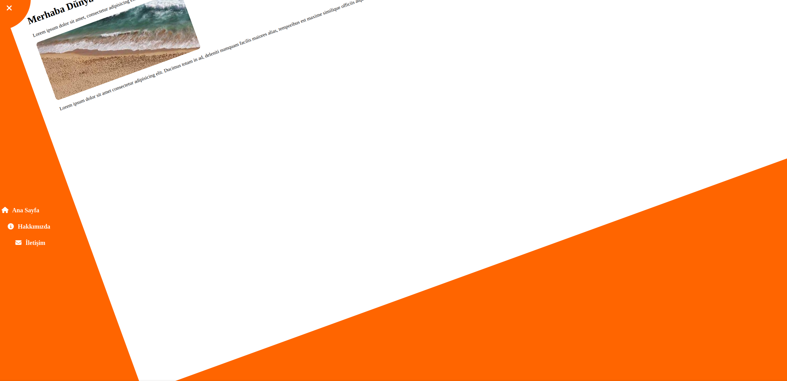

# Basit Dönmeli Menü Arayüzü

Bu projede HTML, CSS ve JavaScript kullanarak dönen bir içerik kutusu ve açılır bir yan menü tasarlandı.

## Özellikler

- Dairesel bir buton ile menü açma-kapama
- Menü açıldığında sayfa içeriği hafifçe rotate oluyor
- Responsive uyumlu sade bir yapı
- Font Awesome ikonlarıyla zenginleştirilmiş menü
- Lorem ipsum örnek içerik ve rastgele görsel

## Kullanılan Teknolojiler

- HTML
- CSS (Flexbox)
- Vanilla JavaScript (vanilla JS)

## Ekran Görüntüsü

## Canlı Demo

👉 [rotate-menu-js-practics.vercel.app](https://rotate-menu-js-practics.vercel.app/)

## Amaç

Bu proje, HTML/CSS/JS pratiği yapmak ve temel animasyon-mekanizma kurulumlarını öğrenmek amacıyla oluşturuldu. Öğrenme sürecinde küçük ama eğlenceli adımlar atmak için güzel bir çalışma oldu.

## Geliştirici Notu

Koda sadelik ön planda tutularak yaklaşıldı. Amacım karmaşıklıktan uzaklaşmak, işlevsel bir deneyim oluşturmaktı.

Bu mini pratik projesini, iş yerindeki boş zamanlarda mobil cihaz üzerinden web kodları yazılabilir mi diye kendime sorduğum bir zamanda geliştirdim. Acode isimli mobil IDE ile yazıldı. Küçük bir deneme ama benim için güzel bir keşifti.

---

🛠️ Öğrenmeye devam...
